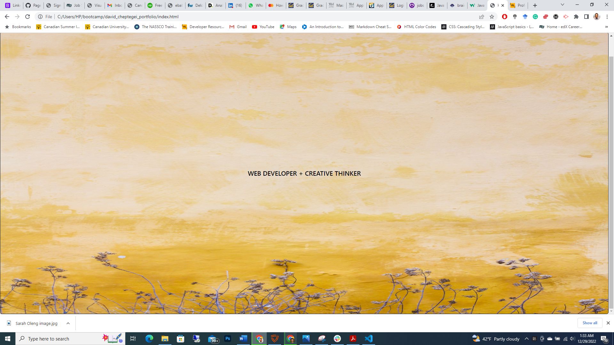

# David Cheptegei Portfolio

## Description

Employers in the tech industry prefer candidates with well prepared portfolios. A portfolio assists a lot during interviews by avoiding to explain what you can do. The main reason for building this website is to have a platform where I can showcase my work to employers. The website enables me to present my work to a potential employer as proof of what I can do. I learned that with CSS one can build a selling and eye appealing portfolio.

## Table of Contents (Optional)

- [Installation](#installation)
- [Usage](#usage)
- [Credits](#credits)
- [License](#license)

## Installation

Just click the follow the link to view my portfolio https://cheptegei-create.github.io/david_cheptegei_portfolio/

## Usage
When the user clicks on the link, they are presented by the landing page of my portfolio with a navigation containing links of the various pages available and a body with a background image. When the user clicks any of the links on the navigation bar, they are directed to the particular page and information is displayed.

## Credits

N/A

## License

Copyright (c) 2022 [David Cheptegei](https://github.com/cheptegei-create)